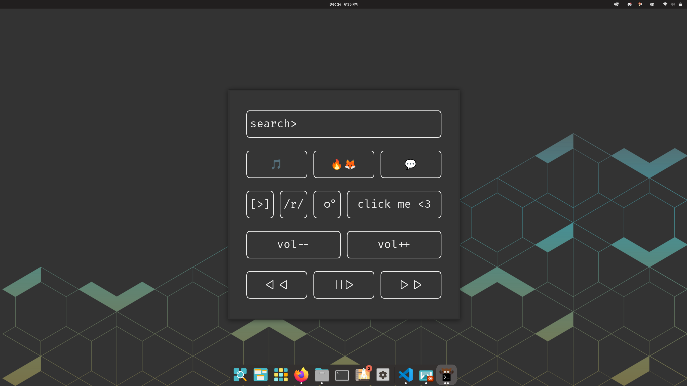

# paneru: launcher panel in your terminal


Who needs a desktop launcher when you can have one in your terminal?  
paneru is a configurable launcher panel that runs in the terminal.  
Each button/input field can run any arbitrary terminal command assigned to it!

## Usage
- Run `paneru` in your terminal
- Click on a button to run the assigned command
- Click an input field to enter arguments to the assigned command. Hit enter to run.
- Press `q` to quit

## Configuration
paneru uses an INI-like configuration file. The example configuration file is copied to `~/.config/paneru.conf` when you run `make`, if it doesn't already exist.

- Use the `[panel]` block to configure the grid-based slot system
- Use the `[button]` block to configure buttons
- Use the `[input]` block to configure input fields

Detailed explanation can be found in the example file.

## Installation
Dependency: `ncurses`
### Build & install
```
git clone https://github.com/pondda/paneru.git
cd paneru
make && sudo make install
```
### Uninstall
`sudo make uninstall`

## Licence
GNU General Public Licence, version 3 (GPL-1.0)